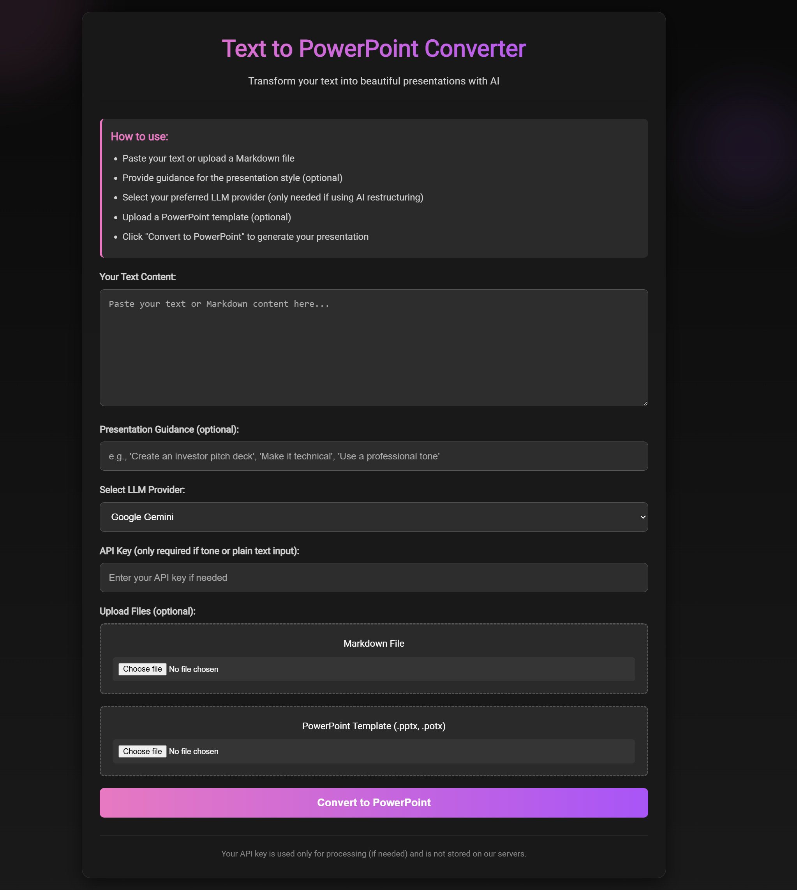

# PPT Generator

A lightweight Python-based tool to generate PowerPoint presentations from Markdown or other text inputs, powered by FastAPI and templating systems.

## Table of Contents

- [Features](#features)
- [Installation](#installation)
- [Usage](#usage)
- [API Endpoints](#api-endpoints)
- [Templates](#templates)
- [Development](#development)
- [License](#license)

---

## Features

- Converts markdown or text content into PowerPoint slides.
- Offers a FastAPI-driven interface supporting file uploads and template selection.
- Utilizes Jinja2 templates and `python-pptx` for slide generation.
- Built with a clean templating system (`templates/`) and organized helper modules (`utils/`).

---

## Installation

1. **Clone the repository**  
   ```bash
   git clone https://github.com/Shreya-agr09/ppt-generator.git
   cd ppt-generator```
2. **Set up virtual environment**
  ```bash
  python3 -m venv .venv
  source .venv/bin/activate```

3. **Install dependencies**
  ```bash
  pip install -r requirements.txt```

## Running locally
uvicorn app:app --host 0.0.0.0 --port 8001 --reload
on ngrock add your auth token and domain and run python app.py

## 📸 Screenshots

### 1. Interface


## 📽️ Demo Video

You can watch the full demo here:  
👉 [Click to Watch on Google Drive](https://drive.google.com/file/d/1Faj4mJyI3gfEXZm5VfC2FlJMnMIk4DpW/view?usp=sharing)

## 📂 Generated Presentations

All generated PPT files are stored in this shared folder:  
👉 [View PPTs on Google Drive](https://drive.google.com/drive/folders/1dKNXHqDuFlCYUjU7KtFSJSuJjDLpXfqq?usp=sharing)
